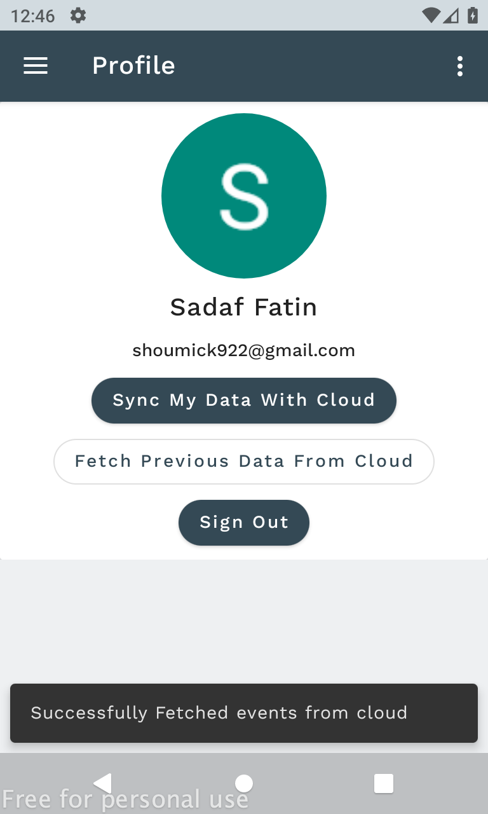

## Weekly Calender

Weekly Calender and Event manager application project.

## Project tools && Info: 

### Framework: Android.
#### Language: Java.
#### Architectural pattern: MVVM.
#### Architectural Component 
##### UI Layer: ViewBinding,DataBinding.
##### Lifecycle: ViewModel,LiveData,Room.
#### Firebase: Firebase Authentication and FireStore   

 

## Installation: 
Clone/download the project.You can see the sample apk from below link.You have to create a new firebase project and integrate your 
app there.Download the google-services.json file and put it in the <b>app</b> folder project's root.
Firebase integration<a href="https://firebase.google.com/docs/android/setup">Add Firebase to your Android project. </a>
 
Browse you project fomr your <a href="https://firebase.google.com/">firebase console.</a>Your DB will look like below

 
<a href="https://drive.google.com/file/d/1T72Wgx368UOiKD_6zEihMHjA_KZabTsU/view?usp=sharing">Sample Apk Download</a>

## Usage: App flow at a glance
  

  

  

### Contributing: 

### Credits: 

### License: 

### Authors: [Sadaf Fatin]
